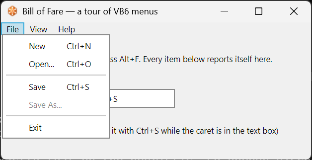

# Bill of Fare

A tour of VB6's **menu** surface — and, like [battleship](../battleship/), a different kind of demo from
the graphical intros: this one exists to be *looked at and clicked*, because every part of it was broken
until recently and each part broke in a way a passing test could not see.

`Bill of fare` is the old term for a menu, which is the joke and the whole subject.

Everything in that one frame was broken at some point during
[#85](https://github.com/hexide-io/HexIDE/issues/85): the bar was empty, then the separators drew nothing,
then a dot, then near-black. It is here because a picture of an open menu is the only artefact that would
have caught any of it.

## What it exercises

| Surface | Where |
|---|---|
| A menu **bar** built from the form's menus | `File`, `View`, `Help` |
| **Sub-items**, nested to two levels | `View ▸ Zoom ▸ Zoom In` |
| **Separators** — a caption of a single hyphen | two in `File`, one in `View` |
| **Shortcuts**, drawn right-aligned and firing from anywhere | `Ctrl+N`, `Ctrl+O`, `Ctrl+S`, `F5`, `F1` |
| **Access keys** — the ampersand marks a letter, it is not printed | `Alt+F`, then `N` |
| A **disabled** item, greyed and unreachable | `File ▸ Save As...` |
| Click **dispatch** to the VB6 event procedure | every item reports itself to the label |

The text box exists for one reason: put the caret in it and press `Ctrl+S`. In VB6 a menu shortcut fires
wherever you are, which is the whole point of having one — and it is the case an implementation is most
likely to get wrong, because a shortcut bound to the menu only works while the menu has focus.

## Why it is here

`demo/` is what CI round-trips when there is no VB6 installation to read the real templates from, and
until this was added there was **no menu form in it at all** — so nothing on CI exercised a menu through
the serializer, despite menu round-tripping being the subject of
[#83](https://github.com/hexide-io/HexIDE/issues/83) and menu rendering of
[#85](https://github.com/hexide-io/HexIDE/issues/85).

It is also a worked example of the project's own rule about visual verification. Every defect below
shipped under a green test suite, and each was found by a person opening the menu and looking:

- the bar was populated but nothing drew, because a `Separator` is laid out one pixel high in `WhiteSmoke`;
- then the separator drew as a **two-pixel dot**, because the IDE's own theme styles every `Separator` as a
  vertical toolbar divider;
- then it drew in near-black, because the colour was a literal rather than the theme's shadow brush.

The assertions that passed throughout were true and useless — `Items[1] is Separator`, then
`Background is not null`. The regression tests now assert the rule is **wider than it is tall**, against
the same resource dictionaries the application merges rather than a set invented by the test harness.

## Running it

`BillOfFare.exe` is committed — just run it. It was built with the real compiler
(`VB98\VB6.EXE /make BillOfFare.vbp`), so the source is known to be genuine VB6 rather than something only
HexIDE will accept.

To open it in HexIDE: `HexIDE.Desktop.exe demo/bill-of-fare/BillOfFare.vbp`, then F5.

## Provenance

Hand-written for this repository. The captions it shares with Microsoft's shipped menu templates — `&File`,
`&New`, `&Save`, `&View`, `&Help`, `E&xit` — are the universal Windows menu vocabulary, and the `mnuFileNew`
naming is the Hungarian convention VB6's own documentation prescribes. Neither is anyone's expression to
own. The structure, the code and the commentary are original.
