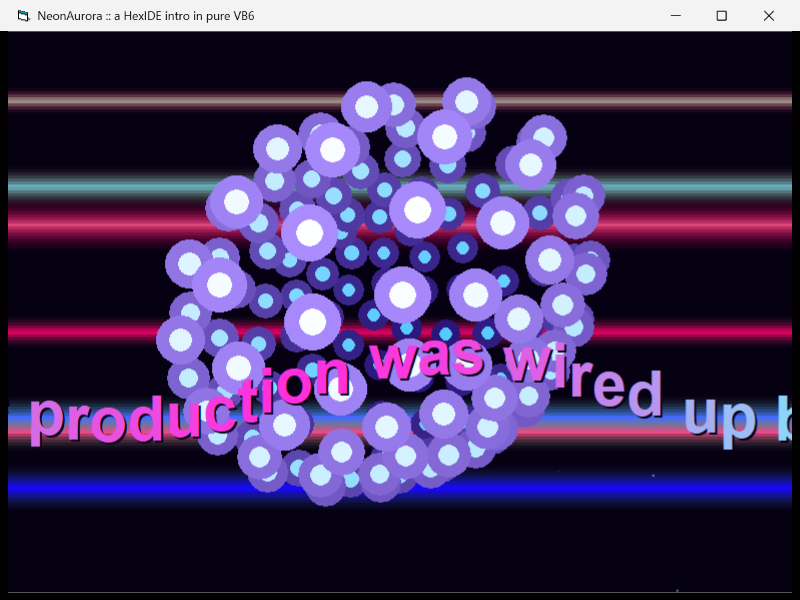
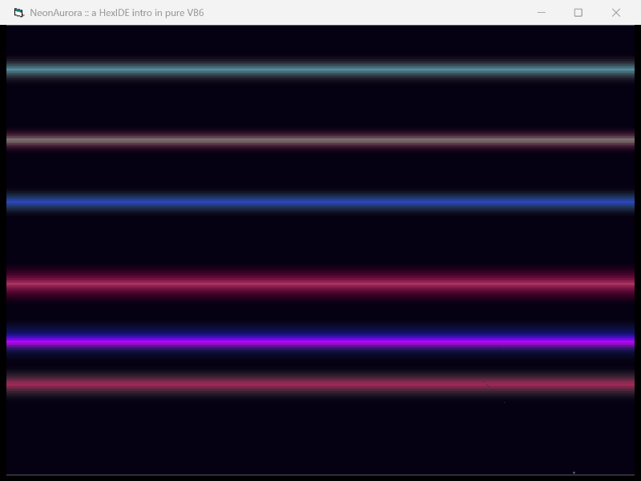
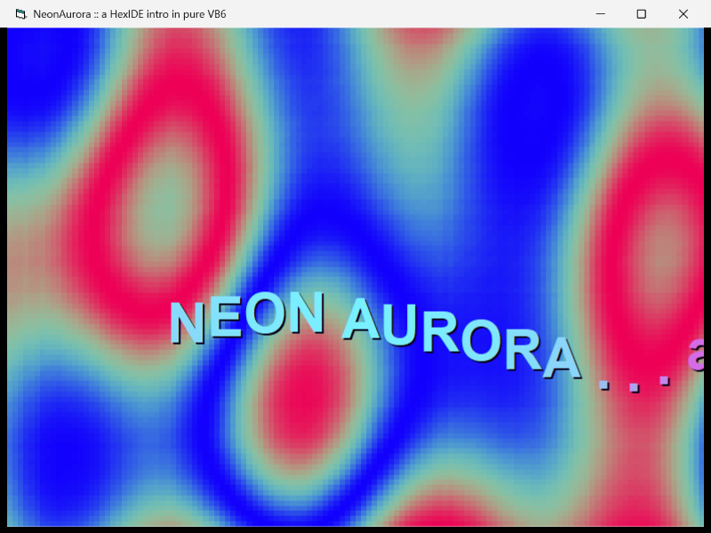
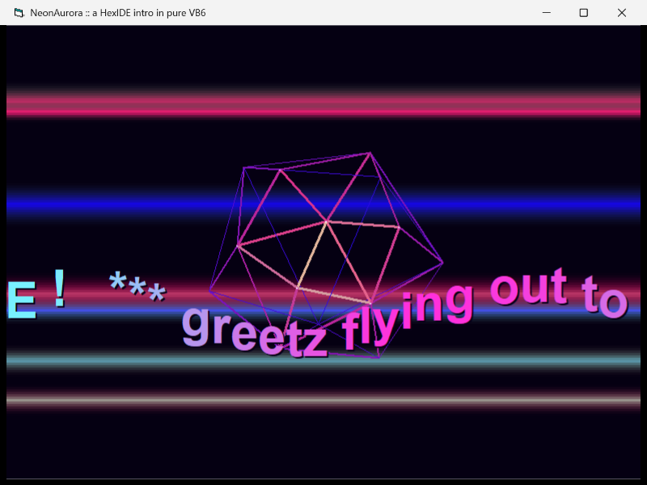
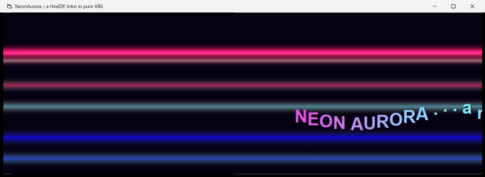

# NeonAurora — a multi-part Amiga-style intro in pure VB6

A self-running demoscene intro composited from **six effect layers**, sequenced by a director,
with **real chiptune music** out of the Windows MIDI synth — all written in classic VB6 6.0 and
built entirely by driving the HexIDE IDE through its MCP automation tools.

The aesthetic is "electric twilight aurora": a cold indigo→magenta→cyan palette glowing on
near-black, shared across every layer by one 256-entry palette in `Module1`.



## What's on screen

A `Timer` (30 ms) drives `gFrame`; the director in `Form1` dispatches the active part's layers
back-to-front each tick, ticks the music, and presents with `Me.Refresh`. It loops forever; **Esc**
quits. Everything is computed per frame and **reflows to any window size** (each layer re-reads
`ScaleWidth`/`ScaleHeight`).

The timeline (≈60 s at ~30 fps, slower under load):

| Part | Layers | |
|------|--------|--|
| Awakening | copper + starfield + scroller |  |
| Plasma Tide | raster plasma + scroller |  |
| Glenz Rising | copper + 3D glenz vector + scroller |  |
| Bob Cloud | plasma + sine bobs + scroller | (see finale) |
| Full Aurora | copper + starfield + bobs + scroller |  |
| Drift Out | copper + starfield + scroller (→ loops) | |

Resize is live — the whole composition recomputes to the new aspect:



## The effects (techniques)

- **Raster plasma** — a fixed 128×96 top-down 32bpp **DIB section**: a `Long` pixel buffer is filled
  each frame from a shared sine LUT, palette-cycled, `CopyMemory`'d into the DIB bits, then
  `StretchBlt`'d to fill the form. Real per-pixel raster work from VB6.
- **Copper bars** — stacked horizontal gradient ridges sliding through the sine LUT, additively
  accumulated per scanline.
- **3D starfield** — perspective-projected stars streaming toward the camera, depth-cued, with a
  deterministic LCG (done in `Double` to dodge VB6's 16-bit `Integer` overflow).
- **Glenz vector** — a rotating wireframe cube-with-spikes star: full 3×3 rotation, perspective
  projection, depth-cued edge colour and width.
- **Sine bobs / vector balls** — a Fibonacci-lattice sphere of dots, tumbled in 3D, painter-sorted,
  drawn as filled circles with a hot cyan-white core over an indigo halo.
- **Sine scroller** — a long greets message scrolled right-to-left, each glyph bobbed by the LUT and
  colour-cycled magenta↔cyan with a drop shadow; double-pass for a seamless wrap.
- **Music** — `winmm` `midiOutShort`, a non-blocking 16-step A-minor loop: synth-bass pulse on one
  channel + a bright square-lead arpeggio (with an octave-up shimmer) on another, advanced on the
  frame clock. Silent no-op if no MIDI device is present.

## How it was built

Architected, authored and adversarially compile-reviewed by a fan-out agent **workflow** (one agent
per effect), then integrated **live through the running IDE via MCP** — `AddModule`/`AddClassModule`
to create each unit, `type_text` to paste each file into the code editor, the Project Properties
dialog to name it, the toolbar to save — and compiled with the **real `vb6.exe`** (clean on the
first try).

## Files

`Form1.frm` (director), `Module1.bas` (shared backbone: GDI/DIB declares, sine LUT, palette),
`Module2.bas` (MIDI music), and six class modules. VB6 numbers class modules `Class1`–`Class6`;
the effect each one holds:

| Module | Effect |
|--------|--------|
| `Class1` | copper bars |
| `Class2` | starfield |
| `Class3` | plasma |
| `Class4` | glenz vector |
| `Class5` | sine bobs |
| `Class6` | scroller |

## Build & run

Requires VB6 installed (`VB98\VB6.EXE`). `NeonAurora.exe` (committed) is the pre-built binary — just run it.

```sh
"C:\Program Files (x86)\Microsoft Visual Studio\VB98\VB6.EXE" /make NeonAurora.vbp
NeonAurora.exe
```
