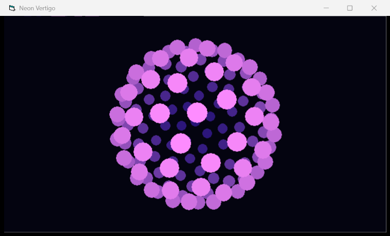

# Neon Vertigo — rotating vector-ball sphere

A self-running VB6 demoscene intro: 130 glowing dots scattered evenly over a sphere, spun on two
axes and thrown into perspective so the near face looms and the far face shrinks away. Brightness
and a magenta→blue palette both fall out of each dot's depth, and the dots are painted back-to-front
so the close ones glow on top. It reflows to any window size (everything recomputes from
`ScaleWidth`/`ScaleHeight` every frame).

Built end-to-end by driving the running HexIDE entirely through the MCP automation tools
(see the `demo-hexide-mcp` skill), then compiled with the real VB6 compiler.



## How it works

- **Even point distribution** — in `Form_Load`, the 130 points are placed with a Fibonacci spiral
  (golden-angle longitude `i * 2.39996`, latitude marching evenly through `-1..1`), so they never
  clump at the poles the way naive lat/long grids do.
- **Rotation** — each frame, every point is spun by two rotation matrices: one about the vertical
  axis (`Sin/Cos` of `t*0.6`), one about the horizontal (`Sin/Cos` of `t`).
- **Perspective** — `persp = 2.6 / (2.6 + z)` shrinks far points and enlarges near ones; the dot
  radius scales with it too.
- **Depth shading** — brightness `br = 1 - (z+1)/2` drives an `RGB(40+215·br, 20+120·br, 120+135·br)`
  neon gradient, bright magenta up close fading to dark blue at the back.
- **Painter's sort** — a bubble sort orders the dots far-to-near each frame so closer dots are drawn
  last and overlap correctly.
- `AutoRedraw = True` gives flicker-free off-screen buffering; a 30 ms `Timer` advances the phase and
  redraws.

## Build & run

Requires VB6 installed (`VB98\VB6.EXE`).

```sh
# from this folder
"C:\Program Files (x86)\Microsoft Visual Studio\VB98\VB6.EXE" /make NeonVertigo.vbp
NeonVertigo.exe
```

`NeonVertigo.exe` (committed) is the pre-built binary — just run it.

## Files

| File | Role |
|------|------|
| `NeonVertigo.vbp` | VB6 project (Standard EXE) |
| `Form1.frm` | Form + Timer + the whole effect (point setup, rotation, projection, depth sort) |
| `NeonVertigo.exe` | Pre-compiled binary |
| `screenshot.png` | The effect running |
