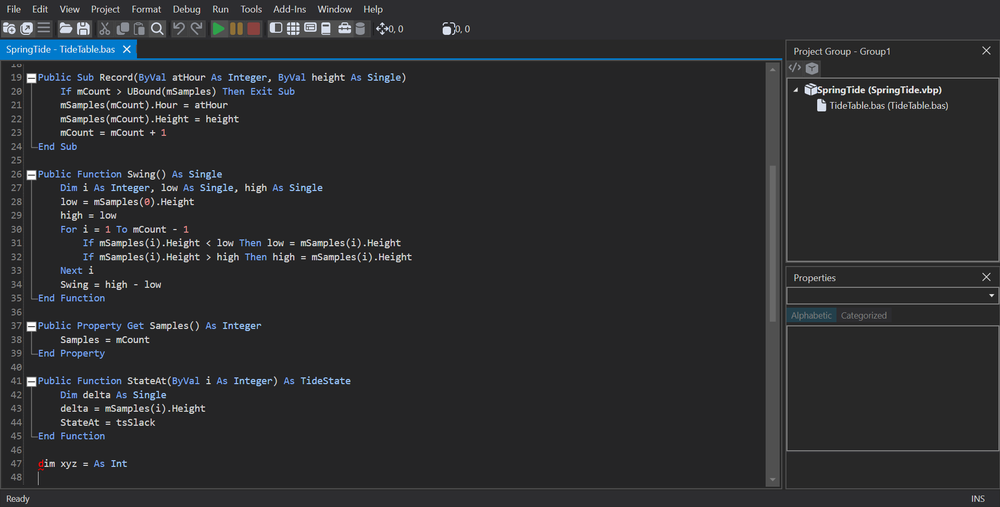

# Spring Tide

*(Different kind.)* Not an intro and not a fidelity check: a short module that exists to be **opened in
HexIDE with a foreign language server attached** — RDCore's — so you can see that server's folding regions and
syntax diagnostics rendered in HexIDE's editor.



It does not build. The last line, `dim xyz = As Int`, is a deliberate syntax error, because a diagnostic is
half of what it is here to show. There is no `Sub Main` either; nothing here runs.

## What comes from where

Everything **coloured** is HexIDE's own lexical highlighting (`IDE/HexIDE/Resources/TextHighlighting/VB6.xshd.xml`),
which needs no server at all. What RDCore supplies:

| On screen | Protocol |
|---|---|
| The fold markers in the gutter | `textDocument/foldingRange` — six regions: `Enum`, `Type`, `Sub`, `Function`, `Property Get`, `Function` |
| The red squiggle on line 48 | `textDocument/diagnostic` — one `VBC00001` syntax error |

To see it for yourself rather than take the screenshot's word for it, launch with `--capture-lsp` and open
**Tools → Protocol Inspector**: both requests and their answers are there.

## Running it

**You need a published RDCore language server that includes
[rubberduck-vba/RDCore#260](https://github.com/rubberduck-vba/RDCore/pull/260)** (merged as `0ed29c9`).
Before it, answering `textDocument/diagnostic` killed the server's entire output channel, so the first pull
silenced everything after it. From an RDCore checkout at or after that commit, run its `PlatformPublish.ps1`.
Measured on Windows, over a named pipe.

**1. Make a profile.** HexIDE keeps settings, layout and its language server configuration in a per-user
directory, and `--user-data-dir` points a session at a different one. So the demo brings its own, and your
own settings are never touched. Copy it somewhere outside the repository, because HexIDE writes into it:

```powershell
Copy-Item -Recurse demo/spring-tide/profile $HOME/spring-tide-profile
```

Then set `command` in the copy's `lsp-servers.json` to your published `RDCore.LanguageServer.exe`.

The profile's second entry switches off HexIDE's bundled VB6 server, for this profile only. Folding would come
from RDCore anyway, because only the highest-priority server is asked for folds. **Diagnostics would not**:
HexIDE merges every server's diagnostics into one set, so with both attached you would be looking at two
servers' opinions at once.

**2. Open it**, from the repository root:

```powershell
cd IDE
dotnet run --project HexIDE.Desktop/ -- --user-data-dir $HOME/spring-tide-profile ../demo/spring-tide/SpringTide.vbp
```

Then double-click **TideTable.bas** in the Project Explorer. The server starts on that first open; allow a
few seconds for its workspace to load. Delete the profile directory when you are done; nothing else needs
undoing.

## Why it is set up the way it is

**`.rdproj`.** RDCore analyses only modules listed in a `.rdproj` at the workspace root, and HexIDE hands it
the directory holding the `.vbp`. Without this file every request is answered — successfully, and with
nothing in it — which looks exactly like clean code. It is the output of `rdc new`, trimmed: the scaffolder
records an absolute path to the local Office install's `VBE7.DLL`, and an empty `References` list gives the
same folds and diagnostics without tying the file to one machine. Keys are PascalCase; a camelCase file loads
without complaint and lists no modules.

Since RDCore began accepting opened documents, a missing `.rdproj` does leave a trace in the protocol
inspector: an error-level `window/logMessage` saying that `textDocument/didOpen` failed with
`The path is empty. (Parameter 'relativeTo')`. It does not mention `.rdproj`. The sentence that does,
`No .rdproj was found under the workspace root.`, goes only to the server's standard output, which HexIDE
does not read ([#724](https://github.com/hexide-io/HexIDE/issues/724)).

**`RelatedDoc=`, not `Module=`.** `SpringTide.vbp` carries `TideTable.bas` as a related document. That is a
workaround, and it is the reason this demo works at all:

- As a module, HexIDE names the file to servers as `vb6://module/TideTable`
  ([#273](https://github.com/hexide-io/HexIDE/issues/273)). RDCore now accepts a document's text when it is
  opened and parses it, but it finds a document again only by its file path. So every answer about the `vb6:`
  name comes back empty, with no message saying why. An `untitled:` name, which #273 gives a document with no
  file yet, fares the same. A carried document is named by its real path.
- A module opened before its server has initialized also never asks for folds
  ([#446](https://github.com/hexide-io/HexIDE/issues/446)). The carried-document view asks again once
  diagnostics arrive; the module view does not.

When #273 is fixed this should become an ordinary `Module=` line, and that change is the test that it was.
Keep `TideTable.bas` listed in `.rdproj` when it does. A file opened but not listed still gets folds and
syntax errors, but not RDCore's semantic checks.

**The error is after the last member, not inside one.** RDCore's parser does not recover after a syntax
error: everything below the first one gets no folds and no diagnostics, and the member containing it is cut
short at the error. With the bad line inside `StateAt`, that fold ended on the error line instead of at
`End Function` — which is the range RDCore reports, but reads as a HexIDE folding bug. On a line of its own
after the last `End Function`, every fold above it is whole.

**The squiggle is one character wide.** RDCore's diagnostic ranges are zero-width (`start` equals `end`);
HexIDE widens a zero-width range to a single character so it can be seen at all.

## Against RDCore's current `main`

Measured on 2026-10-05 against RDCore `a9a4918`, published locally and attached through this profile. The
screenshot predates it.

**Folds follow your edits now, and the squiggle may not.** RDCore receives the text of an opened document,
and the change after each edit, so its folds track what you type. Its diagnostics stop. Line 17,
`Private mSamples(0 To 11) As Reading`, is a declaration carrying a literal value. Such a declaration makes
RDCore's language server fail to send its own environment host a message, and from then on every diagnostic
request that needs RDCore's semantics waits until the next edit cancels it. An array bound, a `Const` value
and an `Optional` default each do it. What you see in HexIDE:
- the squiggle on line 48 appears on some launches and not others, because the first request races the
  failure;
- after an edit, the squiggles no longer change.

Nothing reports the failure itself: not on the wire, not on standard output and not in RDCore's own log files.
To see the demo as intended until RDCore fixes it, change line 17 to `Private mSamples() As Reading`; nothing
here runs, so nothing breaks. HexIDE's own defect on this path, a first edit that repeated the opening
document version, is fixed ([#470](https://github.com/hexide-io/HexIDE/issues/470)); before that fix, RDCore
ignored the first edit outright.

**With that line changed, a second squiggle appears.** RDCore reports `VBC09310` "Type mismatch" on line 35,
`Swing = high - low`, where both are `Single`. That is a false positive in RDCore, and it comes only from a
module listed in `.rdproj`.

**`--language vb6` changes nothing you can see here.** RDCore defaults to VBA. Asked for VB6, it changes only
the wording of one diagnostic's detail, so the profile does not pass it. An option the server does not know
makes it exit at once, before its pipe exists, with the reason on standard error. HexIDE records both the exit
and that output for a pipe server it launched ([#403](https://github.com/hexide-io/HexIDE/issues/403)).
