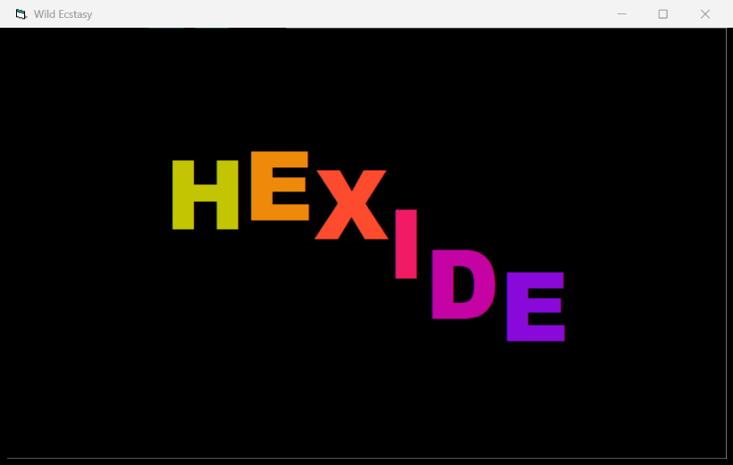

# Wild Ecstasy — big wavy text

A self-running VB6 demoscene intro: the word **HEXIDE** rendered large, with every character
riding its own phase-shifted sine wave so the word ripples like a flag, while each letter's
colour cycles through the spectrum over time. It reflows to any window size (font and layout
recompute from `ScaleWidth`/`ScaleHeight` every frame).

Built end-to-end by driving the running HexIDE entirely through the MCP automation tools
(see the `demo-hexide-mcp` skill), then compiled with the real VB6 compiler.



## How it works

- `Form1` — `AutoRedraw` for flicker-free buffering, `ScaleMode = vbPixels`, a 30 ms `Timer`
  that drives the animation by calling `fx.Render Me` each tick.
- `Class1` — the effect. Sizes the font to the window, measures the word to centre it, then for
  each character computes a vertical offset `Sin(t + i * 0.7) * amp` and an RGB colour from three
  phase-offset sines, and prints it at the running X position.

## Build & run

Requires VB6 installed (`VB98\VB6.EXE`).

```sh
# from this folder
"C:\Program Files (x86)\Microsoft Visual Studio\VB98\VB6.EXE" /make WildEcstasy.vbp
WildEcstasy.exe
```

`WildEcstasy.exe` (committed) is the pre-built binary — just run it.

## Files

| File | Role |
|------|------|
| `WildEcstasy.vbp` | VB6 project (Standard EXE) |
| `Form1.frm` | Form + Timer + animation loop |
| `Class1.cls` | The wavy-text effect |
| `WildEcstasy.exe` | Pre-compiled binary |
| `screenshot.png` | The effect running |
